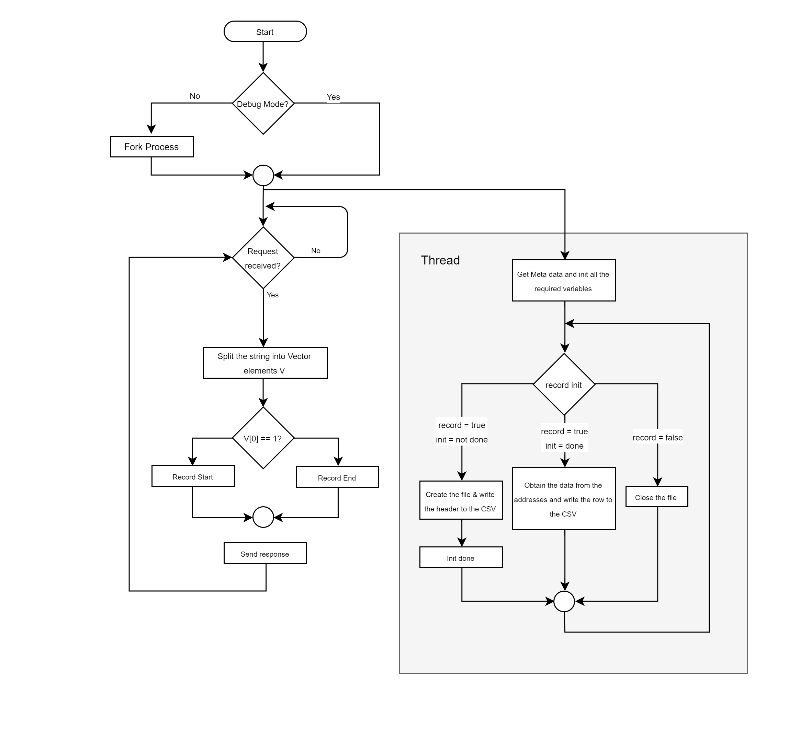

## Data Capture Engine (DCap)

### Description
Data Capture (DCap) can perform a recording of the specified variables whose values are taken from the shared memory, written to a CSV over a duration with a specified sampling frequency.
DCap only acts as a server and the user cannot interact with the engine directly.
DCap engine receives a request to start the recording and receives a list of signals to record from PXTU engine.

#### Capability
1. Can record the signals with various frequencies.
2. Can handle multiple signals.

#### Limitations
No feature for pausing the recording. Should come in future implementations.

#### Run Modes
1. Debug Mode: To run the engine in debug mode, the DEBUG switch in CMakeLists.txt should be set to 1. Doing this will launch the process with connect to the TTY console.
2. Real Mode: Making the DEBUG switch 0 while building, will make the program run as a daemon. The logging takes place in syslog.

#### Building the Engine
1. Direct to linux_build in DCap directory. if one doesn't exist, create it.
2. Type the following "$cmake .. && make". This builds the executable.
3. This executable can be run by "$./dcap".

#### Flowchart
The flowchart below gives a higher level structure of the source.

